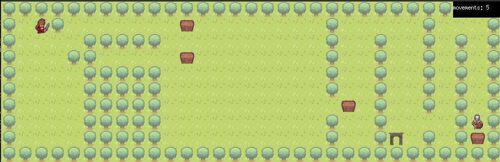

# so_long

| Project Name | so_long |
| :-: | :-: |
| Description | A graphical introduction project using an educative library |
| Technologies | <a href="#"></a> |
| External libraries | open(), close(), read(), write(), malloc(), free(), perror(), strerror(), exit(), All functions from math.h, All functions of the MiniLibX |
| Final grade | 125/125 |

## In game image


## Usage
```
git clone https://github.com/robinbnc/so_long.git
cd so_long
make bonus
./so_long_bonus maps/first_map.ber
```
